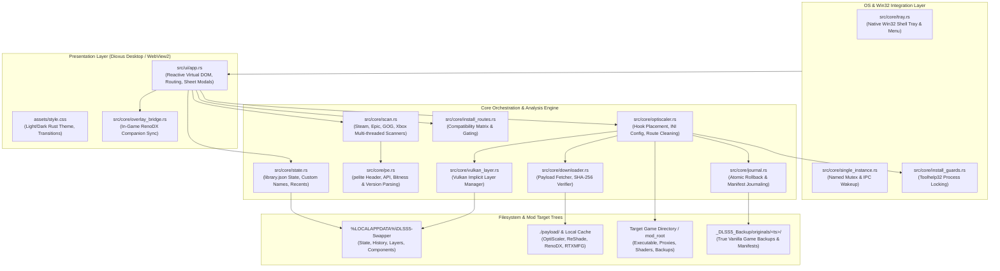
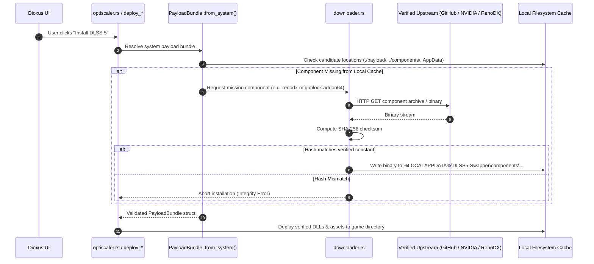
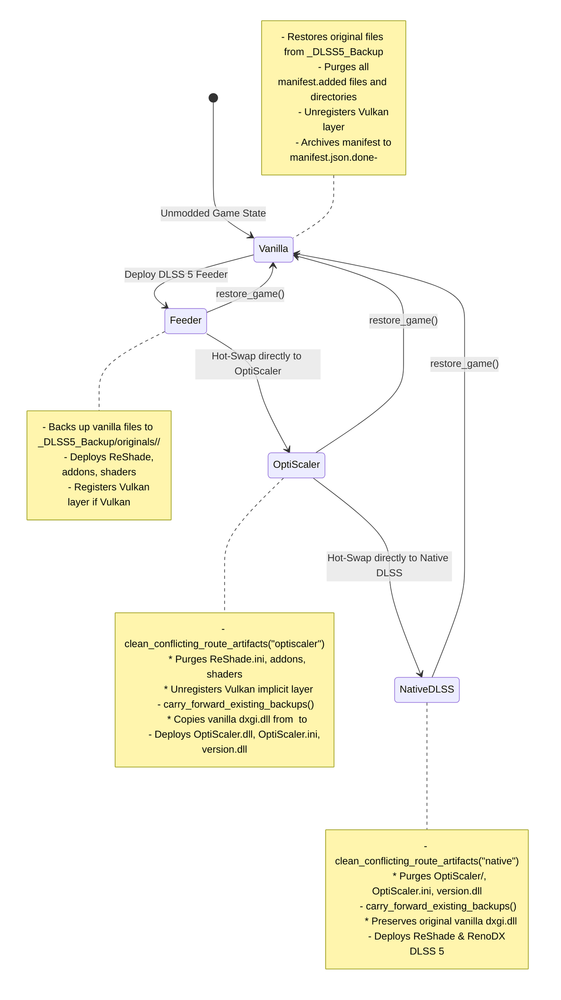

# DLSS Studio (DLSS5-Swapper-Rust) - Technical Architecture

**DLSS Studio** is an ultra-low latency, low-memory DLSS 5, Frame Generation (MFG), and OptiScaler Pre-SR management system written in pure Rust using [Dioxus](https://dioxuslabs.com/) (`v0.6`, desktop) and native Windows Win32 APIs.

This document outlines the complete internal architecture, data flows, hooking mechanisms, store scanning engines, dependency/payload retrieval pipelines, and cross-route lifecycle management.

---

## 1. High-Level System Architecture & Component Topology



---

## 2. Game Discovery & PE Binary Analysis Pipeline

DLSS Studio discovers installed titles without user configuration by directly querying system registries, manifest databases, and drive roots in parallel.

```mermaid
flowchart LR
    subgraph Launchers["Store Discovery Engines"]
        Steam["Steam Engine<br/>HKCU SteamPath & libraryfolders.vdf & *.acf"]
        Epic["Epic Games Engine<br/>%PROGRAMDATA%\Epic\...\Manifests\*.item"]
        GOG["GOG Galaxy Engine<br/>HKLM/HKCU GOG.com\Games & goggame-*.info"]
        Xbox["Xbox Game Pass Engine<br/>GamingServices PackageRepository & XboxGames Drive Scan"]
        Custom["Manual / Added Folders<br/>User specified custom paths"]
    end

    subgraph Resolver["Executable & Root Resolution"]
        CandidateFinder["Multi-Executable Discovery<br/>(Filters crashpad, unins*, helpers, launchers)"]
        ModRootResolver["managed_mod_root()<br/>(Resolves bin/x64/, bin/, or Content/ directories)"]
    end

    subgraph Analysis["Deep PE Binary Inspection (pelite)"]
        PEHeader["PE Header Inspection<br/>Bitness: 64-bit vs 32-bit"]
        ImportScan["Import Table Scanning<br/>DirectX 12, DirectX 11, Vulkan, OpenGL, D3D9"]
        VersionScan["Resource Table Parsing<br/>nvngx_dlss.dll, sl.interposer.dll, nvngx_dlssg.dll versions"]
    end

    Launchers --> CandidateFinder
    CandidateFinder --> ModRootResolver
    ModRootResolver --> Analysis
    Analysis --> GameEntry["GameEntry Object<br/>(API, Bitness, DLSS version, FG capabilities)"]
```



### Store Scanner Technical Details

| Store | Inspection Mechanism | Executable Resolution | Artwork Source |
| :--- | :--- | :--- | :--- |
| **Steam** | Reads registry key `HKCU\SOFTWARE\Valve\Steam\SteamPath`, parses `steamapps/libraryfolders.vdf` for all library mounts, parses `appmanifest_<id>.acf` for `installdir`. | Filters out redistributables and tooling; scores binary names matching game title. | Fetches official Steam vertical poster (`600x900`) from Steam CDN using App ID. |
| **Epic Games** | Scans `%PROGRAMDATA%\Epic\EpicGamesLauncher\Data\Manifests\*.item` JSON documents for `DisplayName` and `InstallLocation`. | Inspects binaries within install directory, prioritizing 64-bit main binaries over launcher helpers. | Extracts bundled launcher icon or queries SteamGridDB scraper. |
| **GOG Galaxy** | Scans `HKLM\SOFTWARE\WOW6432Node\GOG.com\Games` and `HKCU\SOFTWARE\GOG.com\Games` registry trees; parses `goggame-*.info` for `playTasks`. | Resolves target binary specified in primary playtask. | Uses `gameDetails` logo / box art bundled locally in GOG directory. |
| **Xbox Game Pass** | Queries `HKLM\SOFTWARE\Microsoft\GamingServices\PackageRepository\Root` and enumerates all mounted drive letters for `XboxGames/` roots; parses `MicrosoftGame.config` and `AppxManifest.xml`. | **Bypasses dummy `gamelaunchhelper.exe`** to locate the authentic 64-bit game executable specified in the config. | Extracts high-res PNG/JPG logos and splashes directly from package assets, encoding them as inline Data URIs. |
| **My Folders** | Recursive enumeration of user-designated root folders up to depth 3. | Filters out helpers (`UnityCrashHandler.exe`, `unins000.exe`, etc.) and PE-inspects valid game binaries. | Hashes executable directory path to maintain persistent local artwork and title cache. |

### PE Binary Inspection (`src/core/pe.rs`)
Using `pelite::pe64` and `pe32`, binaries are inspected directly on disk without executing code:
1. **Bitness Check**: Reads `Machine` field in `COFF` header (`0x8664` = AMD64, `0x014c` = i386).
2. **Graphics API Determination**: Parses import directory tables for loaded graphics runtimes:
   - `d3d12.dll` / `D3D12CreateDevice` &rarr; **DirectX 12**
   - `d3d11.dll` / `D3D11CreateDevice` &rarr; **DirectX 11**
   - `vulkan-1.dll` / `vkCreateInstance` &rarr; **Vulkan**
   - `opengl32.dll` &rarr; **OpenGL**
   - `d3d9.dll` &rarr; **DirectX 9**
3. **DLSS & Streamline Detection**:
   - Inspects `VS_FIXEDFILEINFO` in PE resource tables of local `nvngx_dlss.dll` and `sl.dlss_g.dll` to read precise semantic versions (e.g., `2.4.2`, `3.7.0`, `310.8.0`).
   - Checks presence of Streamline interposer (`sl.interposer.dll`) and Frame Generation modules (`sl.dlss_g.dll`, `nvngx_dlssg.dll`).

---

## 3. Dependency & Payload Retrieval Pipeline

DLSS Studio packages essential components locally and dynamically retrieves updated runtimes from verified upstream sources, verifying every artifact with cryptographic hashes.



### Component Catalog & Verification Matrix

| Component | Target Location | SHA-256 Verification | Purpose |
| :--- | :--- | :--- | :--- |
| **ReShade 6.8.0** | `dxgi.dll` / `opengl32.dll` / `ReShade64.dll` | Verified runtime hash | Base presentation and addon hook injection engine. |
| **RenoDX v4.7 Integrated Engine** | `renodx-dlss5.addon64` | `c8bc90064d7fa3d0...` | In-process D3D12 NGX vtable detouring & Neural Reconstruction bridge. |
| **4x MFG Unlock Addon** | `renodx-mfgunlock.addon64` | `64184bb370f223c3...` | Intercepts Streamline Frame Generation contracts to unlock up to 4x multiplier. |
| **Universal RTXMFG v1.3.2** | `version.dll` | Verified standalone hash | Standalone proxy hook for vendor-agnostic 4x Frame Generation. |
| **DLSS 5 Feeder Stack** | `dlss5-feed.addon64`, `DLSS5_Feed.fx`, `vort_Motion.fx` | Verified bundle hash | Captures color and motion vectors in non-DX12 / non-Streamline titles. |
| **OptiScaler 0.7.7** | `OptiScaler.dll`, `OptiScaler.ini`, `OptiScaler/` | Verified archive hash | Open-source multi-vendor DLSS replacement and Pre-SR sharpening pipeline. |
| **Streamline 2.14.1 Stack** | `sl.interposer.dll`, `sl.common.dll`, `sl.dlss_g.dll`, `sl.reflex.dll`, `sl.pcl.dll` | Verified release stack | Canonical runtime stack to eliminate driver OTA ABI mismatch crashes (`0xC0000005`). |
| **NVIDIA DLSS-NR 310.8.0** | `nvngx_dlssnr.dll`, `nvngx.dll_dlssnr.dll` | Verified driver snippet | Official signed NVIDIA Neural Reconstruction and Ray Reconstruction runtime. |

---

## 4. Installation Route Decision Matrix & Gating

```mermaid
flowchart TD
    Start([Game Selected in UI]) --> BitCheck{Is 64-bit?}
    BitCheck -- No (32-bit) --> FeederOnly[Only Feeder Route Available<br/>OptiScaler & Native DLSS blocked]
    BitCheck -- Yes (64-bit) --> ApiCheck{Graphics API}

    ApiCheck -- "DirectX 12" --> DX12Paths
    subgraph DX12Paths["DirectX 12 Title"]
        D12DLSS{Has Native DLSS?}
        D12DLSS -- Yes --> NativeOpti[Native DLSS 5 RenoDX<br/>OR OptiScaler Pre-SR<br/>OR Feeder]
        D12DLSS -- No --> FeederOrOpti[Feeder Route<br/>OR OptiScaler Pre-SR]
    end

    ApiCheck -- "DirectX 11" --> DX11Paths
    subgraph DX11Paths["DirectX 11 Title"]
        D11Routes[Feeder Route OR OptiScaler Pre-SR]
        D11Gating[4x Multi-Frame Generation STRICTLY BLOCKED<br/>(Requires Vulkan Streamline injection)]
    end

    ApiCheck -- "Vulkan" --> VulkanPaths
    subgraph VulkanPaths["Vulkan Title (e.g. BG3)"]
        VKRoutes[Feeder Route OR OptiScaler Pre-SR]
        VKFG[4x MFG Injection SUPPORTED<br/>(Streamline hooks via Vulkan Implicit Layer)]
    end

    ApiCheck -- "OpenGL / DX9" --> LegacyPaths
    subgraph LegacyPaths["OpenGL / DirectX 9"]
        LegRoutes[Feeder with opengl32.dll / d3d9.dll hook]
    end
```

### Route Comparison Matrix

| Feature / Attribute | Native DLSS 5 (RenoDX) | DLSS 5 Feeder | Pure OptiScaler Pre-SR |
| :--- | :--- | :--- | :--- |
| **Primary Hook Mechanism** | `dxgi.dll` (ReShade) or native NGX detours | `dxgi.dll` / `opengl32.dll` + ReShade shaders | `dxgi.dll` (OptiScaler) |
| **Target Graphics APIs** | DirectX 12 native NGX | DirectX 11, Vulkan, OpenGL, DX12 non-NGX | DirectX 11, DirectX 12, Vulkan |
| **Neural Rendering (DLSS-NR)** | Full hardware acceleration via `nvngx_dlssnr.dll` | Optical flow capture via `vort_Motion.fx` | Optional fallback pass |
| **4x Frame Generation Support** | Integrated via `renodx-mfgunlock.addon64` | Integrated via `renodx-mfgunlock.addon64` (Vulkan/DX12 only) | External via Dashdogy `version.dll` |
| **Vulkan Layer Requirement** | None | Registered via `VkLayer_feed_vk.json` if Vulkan | None (Layer explicitly unregistered) |
| **Configuration Files** | `ReShade.ini` (`EnableHooks=1`) | `ReShade.ini`, `ReShadePreset.ini`, `dlss5-feed.cfg` | `OptiScaler.ini`, `RTXMFG-Universal.json` |

---

## 5. Runtime Interception & Hooking Architecture

### A. DirectX Dynamic Library Proxying
DLSS Studio leverages standard Windows DLL search order (`LoadLibrary` / application directory precedence) by placing proxy DLLs matching system graphics runtimes directly adjacent to the game binary:
1. `dxgi.dll` (DirectX Graphics Infrastructure - default hook for DX11 and DX12).
2. `d3d11.dll` / `d3d12.dll` (Direct3D runtime proxies for titles using explicit subsystem loads).
3. `version.dll` (Used exclusively for Dashdogy Universal RTXMFG v1.3.2 standalone Frame Generation).
4. `opengl32.dll` (Used for OpenGL games like Ren'Py/ANGLE).
5. `d3d9.dll` (Used for legacy DirectX 9 titles).

### B. Vulkan Implicit Layers
On Vulkan titles (e.g., *Baldur's Gate 3* `bg3.exe`), Windows does not load DLLs via directory proxying. Instead, DLSS Studio manages a native Vulkan Implicit Layer:
1. Manifest files (`VkLayer_feed_vk.json` and `ReShade64.json`) are maintained in `%LOCALAPPDATA%\DLSS5-Swapper\vulkan_layers\`.
2. The manifest path is registered in Windows Registry under:
   `HKCU\SOFTWARE\Khronos\Vulkan\ImplicitLayers` with `DWORD = 0`.
3. An internal isolation file, `registered_games.json`, tracks game directories authorized to load the layer.
4. When switching away from Feeder to OptiScaler or restoring originals, the layer is dynamically unregistered so the Vulkan loader never loads ReShade into non-Feeder games.

### C. RenoDX D3D12 NGX Detouring
In native DirectX 12 titles, `renodx-dlss5.addon64` hooks directly into the NVIDIA NGX vtable:
```text
NVSDK_NGX_D3D12_CreateFeature   -> Hooked to RenoDX pre-processor
NVSDK_NGX_D3D12_EvaluateFeature -> Hooked to RenoDX inline Neural Reconstruction pipeline
NVSDK_NGX_D3D12_ReleaseFeature  -> Hooked to resource teardown
```
- When the game evaluates `Feature=1` (DLSS Super Resolution), RenoDX intercepts the compute list.
- It instantiates `Feature=18` (DLSS Neural Reconstruction) using the signed `nvngx_dlssnr.dll` driver snippet.
- Host GPU state (Root Signatures, Descriptors, CBV/SRV/UAV heaps) is captured before evaluate and restored afterward.
- A circular 4-slot ring buffer pool manages in-flight command allocators to prevent GPU race conditions during burst rendering.

---

## 6. Atomic Journaling, Rollback & Seamless Hot-Swapping

DLSS Studio enforces strict atomic rollback and backup continuity. The application never corrupts original game files, regardless of how many times a user switches between routes.



### Critical Safeguards
1. **Running Game Guard (`assert_game_closed`)**:
   - Queries Win32 Toolhelp32 snapshots to verify neither the game binary nor launchers are executing before modifying, deploying, or restoring files.
2. **Corrupted Backup Prevention (`is_proxy_hook`)**:
   - Validates every candidate backup file using PE export markers and string scans. If a file is a proxy hook or mod binary, it is **never** copied into the backup pool or restored over a game file.
3. **Continuous Backup Pool (`carry_forward_existing_backups`)**:
   - When switching directly from Route A to Route B without an intermediate "Restore Originals", the original unmodded game files recorded in the previous manifest are carried forward into the new backup prefix, ensuring a future "Restore" returns the game to 100% genuine vanilla state.
4. **Cross-Route Conflict Cleaner (`clean_conflicting_route_artifacts`)**:
   - Automatically unregisters Vulkan layers and deletes foreign DLLs, INIs, shaders, and configs before deploying the new route, preventing multiple mod runtimes from colliding.
